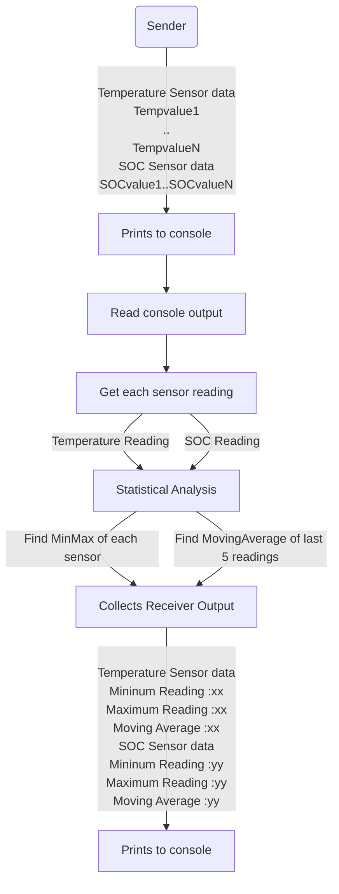

##  Receiver : Streaming BMS Data

## Quality Parameters
Quality parameters used in this repo and updated in `.github/workflows` folder

- Maximum complexity (CCN) per function:  3 CCN 
- Lines of duplicate code allowed: 2 
- Ensured 100% line and branch coverage at every step. Included coverage_receiver in main-workflow yml.

## Receiver flowchart

## Implemented  functionality
- Sender sends two battery parameters - Temperature and SOC - in the following format

    ----------Temperature Sensor data----------
    
    Tempvalue1
    
    ..
    
    TempvalueN
    
    ----------SOC Sensor data----------
    
    SOCvalue1
    
    ..
    
    SOCvalueN
    

- Reads the console output of sender and split by lines
- Separate each readings into list
- The readings are now grouped into two.
     1. Temparature : Reading after "----------Temperature Sensor data----------" and above "----------SOC Sensor data----------"
     2. SOC : Readings after "----------SOC Sensor data----------" till end of console output
- This approach was used as number of readings from both sensors are not constant. (Based on sender implementation , if the reading is in invalid range , it is skipped)
- Now this list is converted from string to Numerical Array for further statistical analysis
- A Parameter list is formed with both sensors' readings and console prints
- Statistical analysis for each paramter readings - MIN_MAX and Moving average with a window size of last 5 readings
- Prints the output of receiver's statistical analysis to the console

## Integrated Sender to Receiver

Output of sender is piped to receiver using 

./sender -o SenderTestlog.txt |& tee SenderOutput.txt | python Receiver.py

- ./sender : calls the C++ executable for sender
- -o SenderTestlog.txt : outputs the test results to SenderTestlog.txt 
- |& tee SenderOutput.txt : Prints the output of sender.exe to Console and to file SenderOutput.txt
- python Receiver.py : calls the Receiver implementation in python

## Tests added

To test the receiver independent of sender, a test file is generated (SenderData_forTest.txt) with same format

- Checks format read from SenderData_forTest.txt
- Test the parameter list generated
- Tests the data separation into based on parameters
- Tests conversion to numerical array
- Test cases to get Min and Max of an array
- Test cases to get moving average with varying window size 
- Test to check both minmax and moving average
- Test for receiver output

